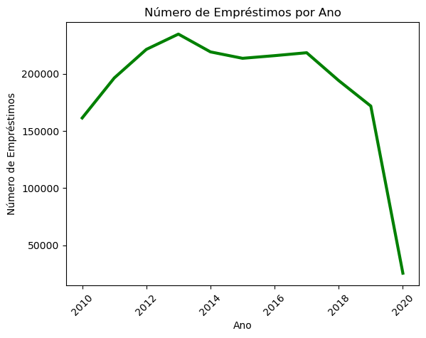
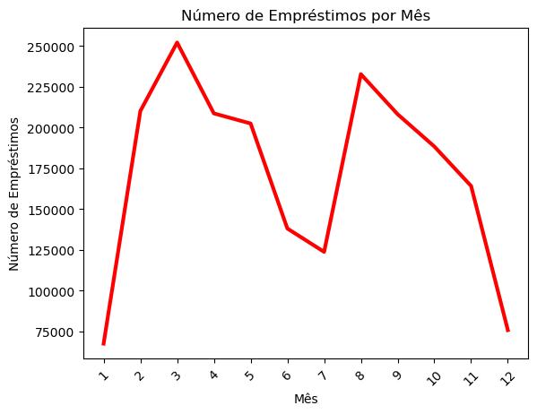
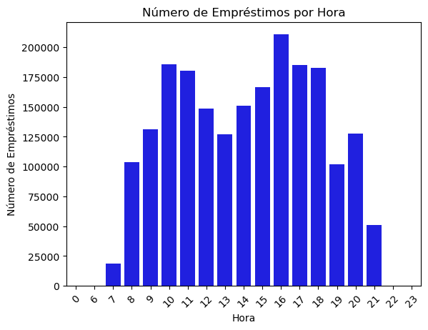

## Desafio #7DaysOfCode - Pandas

PS: Readme desenvolvido com GenIA fazendo a leitura do arquivo do código utilizando a biblioteca LangChain.

**Dia 1: Carregando os Dados e Primeiras Análises**

- **Descrição:**

  - Começo do desafio #7DaysOfCode com Pandas! 🎉
  - Apresentação do conjunto de dados: contexto, fonte, o que ele representa.
  - Carregamento do dataset utilizando Pandas (`pd.read_csv()`).
  - Exploração inicial: primeiras linhas (`df.head()`), informações gerais (`df.info()`), estatísticas descritivas (`df.describe()`).
  - Limpeza básica: verificar se existem dados duplicados, verificar se há dados faltantes (`df.isnull().sum()`) e decidir como lidar com eles (excluir linhas/colunas ou preencher).
  - Bases: mesclar as diferentes bases.

**Dia 2: Limpeza e Transformação de Dados com Pandas**

- **Descrição:**

  - Classificação CDU: Foi criada uma lista (`CDU_lista`) para classificar as localizações dos livros de acordo com a Classificação Decimal Universal (CDU).
  - Adição da classificação CDU: A lista `CDU_lista` foi adicionada como uma nova coluna (`CDU_classification`) no conjunto de dados `complete_data`.
  - Exclusão da coluna registro_sistema: A coluna `registro_sistema` foi removida do conjunto de dados `complete_data`.
  - Conversão da coluna matricula_ou_siape: A coluna `matricula_ou_siape` foi convertida de float para string.

  Essas ações visam organizar e padronizar os dados para que possam ser analisados de forma mais eficiente.

**Dia 3: Descobrindo Tendências e Padrões com Pandas**

- **Descrição:**
  - Tratamento de dados: O código começa convertendo as colunas `data_emprestimo`, `data_renovacao` e `data_devolucao` do tipo string para o tipo datetime.
  - Análise de empréstimos por ano: O código calcula a quantidade total de empréstimos por ano e armazena os resultados em um DataFrame chamado `emprestimos_por_ano_df`. Em seguida, gera um gráfico de linha para visualizar os resultados.
    
  - Análise de empréstimos por mês: O código calcula a quantidade total de empréstimos por mês e armazena os resultados em um DataFrame chamado `emprestimos_por_mes_df`. Em seguida, gera um gráfico de linha para visualizar os resultados.
    
  - Análise de empréstimos por hora: O código calcula a quantidade total de empréstimos por hora e armazena os resultados em um DataFrame chamado `emprestimos_por_hora_df`. Em seguida, gera um gráfico de barras para visualizar os resultados.
    

O objetivo do código é analisar a frequência de empréstimos ao longo do tempo e identificar tendências e padrões nos dados.

**DIA 4: Análise de Frequência e Média**

**Descrição:**

Neste dia, realizamos uma análise de frequência e média para entender melhor os padrões de empréstimo de exemplares na biblioteca. Utilizamos a biblioteca Pandas para gerar tabelas de frequência e gráficos de barras para visualizar os resultados.

**Análise de Frequência**

A análise de frequência nos permite entender como os empréstimos de exemplares estão distribuídos entre as diferentes variáveis categóricas. Neste dia, realizamos a análise de frequência para as seguintes variáveis:

- Tipo de vínculo do usuário
- Coleção
- Biblioteca
- Tema da CDU (Classificação Decimal Universal)

Os resultados mostram que:

- Os empréstimos de exemplares estão mais concentrados em usuários com vínculo de aluno e professor.
- As coleções mais emprestadas são as de literatura e ciências exatas.
- As bibliotecas com mais empréstimos são a Biblioteca Central e a Biblioteca de Ciências.
- Os temas mais emprestados são os de ciências exatas e literatura.

**DIA 5: Análise para entender como os empréstimos de exemplares se distribuíram ao longo dos anos, especificamente para os alunos de graduação e pós-graduação**

**Descrição:**

Neste dia utilizamos a coleção que teve a maior frequência de empréstimos, que foi o "Acervo Circulante", e criamos dois recortes de dados:

1. Alunos de graduação:

- Você filtrou os dados para incluir apenas os alunos de graduação que emprestaram exemplares da coleção "Acervo Circulante".
- Você criou uma nova coluna "ano" e "mes" a partir da coluna "data_emprestimo".
- Você calculou a quantidade de empréstimos por ano e mês.
- Você gerou um gráfico de boxplot para visualizar a distribuição dos empréstimos mensais ao longo dos anos.

2. Alunos de pós-graduação:

- Você seguiu os mesmos passos que para os alunos de graduação, mas filtrando os dados para incluir apenas os alunos de pós-graduação.

Os gráficos de boxplot gerados mostram a distribuição dos empréstimos mensais ao longo dos anos para cada grupo de alunos. Esses gráficos podem ajudar a identificar padrões e tendências nos empréstimos de exemplares ao longo do tempo.

Algumas perguntas que podemos responder com essa análise incluem:

- Qual é a distribuição dos empréstimos mensais ao longo dos anos para os alunos de graduação e pós-graduação?
- Quais são os anos com mais empréstimos para cada grupo de alunos?
- Existem padrões ou tendências nos empréstimos de exemplares ao longo do tempo?

Essa análise pode ser útil para entender como os alunos de graduação e pós-graduação utilizam a biblioteca e para identificar oportunidades para melhorar os serviços da biblioteca.

**Dia 6: Novos dados, novas análises**

**Objetivos**

- Integrar novos dados sobre os cursos de graduação dos usuários
- Analisar a quantidade de empréstimos realizados por cada curso de graduação entre 2015 e 2020

**Dados utilizados**

- `matricula_alunos.xlsx`: arquivo Excel com informações sobre os alunos de graduação
- `cadastro_alunos.json`: arquivo JSON com informações sobre os alunos de graduação
- `complete_data`: conjunto de dados com informações sobre os empréstimos realizados

**Análises realizadas**

- Integrar os dados de `matricula_alunos.xlsx` e `cadastro_alunos.json` em um único conjunto de dados
- Filtrar os dados para incluir apenas os alunos de graduação que realizaram empréstimos entre 2015 e 2020
- Analisar a quantidade de empréstimos realizados por cada curso de graduação
- Criar uma tabela pivot para visualizar os resultados

**Código utilizado**

- `pd.read_excel()` e `pd.read_json()` para carregar os dados
- `pd.concat()` para integrar os dados
  ...
- Criar visualizações para apresentar os resultados de forma clara e eficaz
- Integrar os resultados com outras análises para obter uma visão mais completa dos dados.
